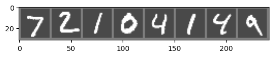

# MNIST Digit Classification Using Deep Learning

This project involves using deep neural networks to classify digits from the MNIST dataset. This task will be done by constructing a CNN using PyTorch

-----------------
## Introduction and Proposal

The goal of this project is to analyze the MNIST dataset and classify handwritten digits 0-9 by implemented a Convolutional Neural Network using PyTorch. The dataset includes 70,000 grayscale images of handwritten digits with their associated labels (0-9). This is a classification task that will better our understanding of deep neural networks, specifically CNNs.

The project notebook is broken down into the following sections:

1. Data Loading
2. Data Processing
3. Baseline Model Training 
4. Convolutional Neural Network Training
5. Model Evaluation
6. Conclusion

We will also explore various hyperparameters such as learning rate, dropout rate, and activation functions to optimize the performance of our model.

**Proposal:** Compare the results of a convolutional neural network with a baseline fully connected network to gain insights on the effectiveness of CNN's for image recognition tasks.

-----------------
## Methodology

The first step in this project was to train the baseline model. To do so, I decided to train a simple fully connected NN to get a baseline accuracy score.

### Network Structure

**Base model, with fully connected layers:**

The baseline model had the following structure:

FullyConnectedNN(
  (fc1): Linear(in_features=784, out_features=128, bias=True)
  (fc2): Linear(in_features=128, out_features=64, bias=True)
  (fc3): Linear(in_features=64, out_features=10, bias=True)
)

It contained 3 fully connected layers.

**Convolutional Neural Network:**

The CNN had the following structure:

CNN(
  (conv1): Conv2d(1, 32, kernel_size=(3, 3), stride=(1, 1), padding=(1, 1))
  (pool): MaxPool2d(kernel_size=2, stride=2, padding=0, dilation=1, ceil_mode=False)
  (conv2): Conv2d(32, 64, kernel_size=(3, 3), stride=(1, 1), padding=(1, 1))
  (fc1): Linear(in_features=3136, out_features=128, bias=True)
  (fc2): Linear(in_features=128, out_features=64, bias=True)
  (fc3): Linear(in_features=64, out_features=10, bias=True)
)

The CNN had 2 convolutional layers, 3 fully connected layers, and a max pooling layer.

The parameters for each of the layers are as follows:

    First conv. layer (input: 1 channel, output: 32 channels, kernel size: 3x3)

    Max pooling layer (2x2 window), stride set at 2

    Second conv. layer (input: 32 channels, output: 64 channels, kernel size: 3x3)

    First fully connected layer (64 channels * 7 * 7 image size)

    Second fully connected layer (128 input features, 64 output features)

    Output layer (64 input features, 10 output features)

### Training and Validation Process

Before loading the dataset, we defined some transformations using torchvision.transforms.

When the data is loaded in, it is normalized with a mean of 0.1307 and a standard deviation of 0.3081,which are specific to the MNIST dataset.

Mean: 0.1307, represents the mean pixel intensity for the MNIST dataset

Standard deviation: 0.3081, represents the standard deviation of the pixel intensity

Once the data was loaded in, we defined batch size and dataloaders for the training and testing sets. I tried various batch sizes (32, 64, 128) and decided to stick with a batch size of 64.

Within the forward pass for the training process, each layer was activated using the ReLU activation function.

The results were measured by monitoring the cross entropy loss over 5 epochs using Adam optimizer with a learning rate of .001.

-----------------
## Evaluation and Results

### Training and Validation Results

**Baseline Performance:** 

Test Loss: 0.0013

Test Accuracy: 97.42%

**CNN Performance:** 

Test Loss: 0.0006

Test Accuracy: 98.88%

### Performance Compared to Baseline

Here, we see that we were able to improve the model accuracy by over 1 percent and cut the testing loss in half.

Given the nature of the dataset, these results make sense. The MNIST dataset is relateively small and simple, so high accuracy scores were not too difficult to attain. With a baseline accuracy of 97.43%, there was not a whole lot of room to improve. Regardless, we were still able to see the effectiveness of CNN's for image recognition tasks and were able to further increased the accuracy of the model.

### Hyperparameter (learning rate, batch size, activiation)

To tune the hyperparameters, I played around with different values for various parameters. This process involves updating the learning rate, batch size, number of epochs, and activation functions. I found the the best performing parameters were:

- .001 learning rate
- 64 batch size
- 5 epochs
- ReLU activation function

I determined these parameters based on various metrics. I took into account the training time, variance, and model performance to select these hyperparameters. Ultimately, we were able to create a model that was accurately able to classify digits in the MNIST dataset.

-----------------
## Conclusion

In conclusion, this project successfully demonstrated the effectiveness of Convolutional Neural Networks for the task of digit classification using the MNIST dataset. By comparing the performance of a baseline fully connected network with a CNN, we observed a significant improvement in accuracy and reduction in loss, highlighting the superior capability of CNNs in handling image data.
